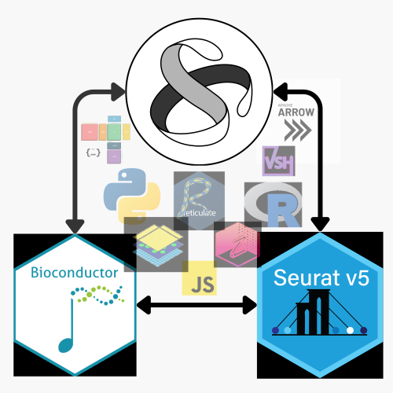

# Polyglot programming for single-cell analysis 

This book is a collection of notebooks and explanations for the workshop on **Polyglot programming for single-cell analysis** given at the [scverse Conference 2024](https://scverse.org/conference2024). For more information, please visit the [workshop page](https://cfp.scverse.org/2024/talk/AWKXCB/).

## Installation

For the best polyglot experience on Linux, we recommend using [Pixi](https://pixi.sh/latest/) to manage your development environment. Environment creation support for Pixi on Windows and MacOS ARM is currently limited for R packages. Installation of the R dependencies in Pixi is more difficult, because Pixi does not support [post-link scripts](https://github.com/prefix-dev/pixi/issues/1573) and the bioconda channel for bioconductor packages does not yet support [osx-arm64](https://github.com/bioconda/bioconda-recipes/issues/33333).

In a clean Linux shell without any active Python (`deactivate`) or Conda environments (`conda deactivate`), you can install all dependencies with the following command:

```bash
pixi install -a
```

For MacOS ARM and Windows, we recommend using Docker. For R users, we recommend `renv` to manage the R and Python dependencies.

## Linux

To run the pipeline on Linux, use the following command:

```bash
pixi run pipeline
```

## Docker

To run the pipeline with Docker, use the following command. The image is ~5GB and the pipeline can require a lot of working memory ~20GB, so make sure to increase the RAM allocated to Docker in your settings. Note that the usecase/data/ and scripts/ folders are mounted to the Docker container, so you can edit the scripts and access the data.

```bash
docker pull berombau/polygloty-docker:latest
docker run -it -v $(pwd)/usecase/data:/app/usecase/data -v $(pwd)/book/disk_based/scripts:/app/scripts berombau/polygloty-docker:latest pixi run pipeline
```

## renv

### First time setup

To install the R and Python dependencies, use the following command. Start a new R session with `R` or run within `RStudio`:

```R
install.packages("renv")
renv::restore()
```

On MacOS ARM, you will need [extra configuration](https://firas.io/posts/r_macos/) and patience to be able to build some of the packages. The Docker approach is recommended for MacOS ARM.

### Adding new packages

If you want to install a new R package, use the following command:

```R
renv::install("anndata")
```

If you want to install a new Python package, use the following command:

```bash
reticulate::py_install(c("rich>=13.7,<13.8", "anndata>=0.10.8,<0.11", "numpy>=1.24,<2", "scanpy>=1.10,<2", "mudata>=0.3,<0.4", "rpy2>=3.4,<4", "jupyter"))
```

After installing a new package, use the following command to update the `renv.lock` file:

```R
renv::snapshot()
```

### Using the environment

To use the environment, use the following command:

```bash
# ensure that jupyter can also use the renv environment
source renv/python/virtualenvs/renv-python-3.12/bin/activate
quarto preview
```

Or to render the slides:

```bash
source renv/python/virtualenvs/renv-python-3.12/bin/activate
quarto render
```


## Extra

### Building the Docker image yourself

To edit and build the Docker image yourself, use can use the following command.:

```bash
docker build -t polygloty-docker .
docker run -it -v $(pwd)/usecase/data:/app/usecase/data -v $(pwd)/book/disk_based/scripts:/app/scripts polygloty-docker pixi run pipeline
```

To publish it to Docker Hub, use the following command:

```bash
docker login
docker buildx build --push --platform linux/amd64,linux/arm64 --tag berombau/polygloty-docker:latest .
```

More info on Pixi and Docker can be found [here](https://github.com/prefix-dev/pixi-docker).
